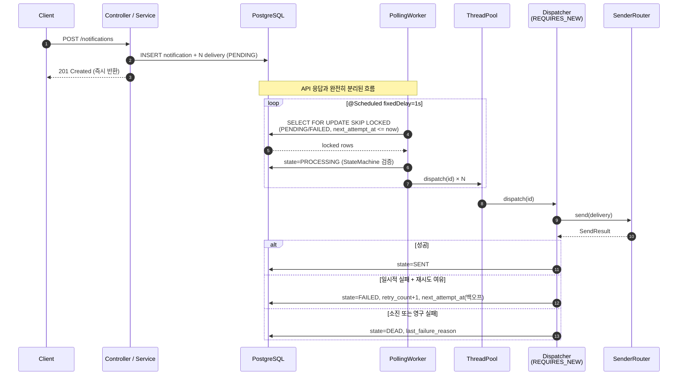
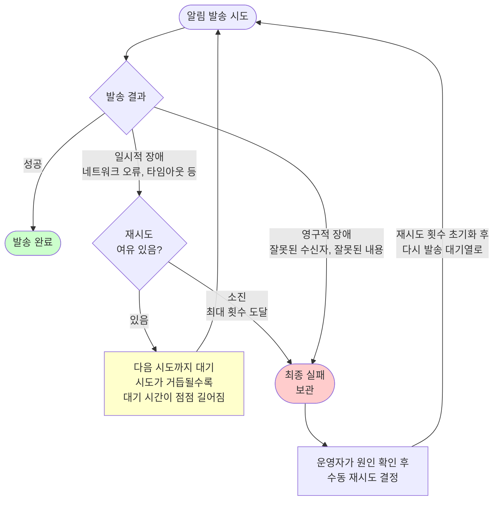
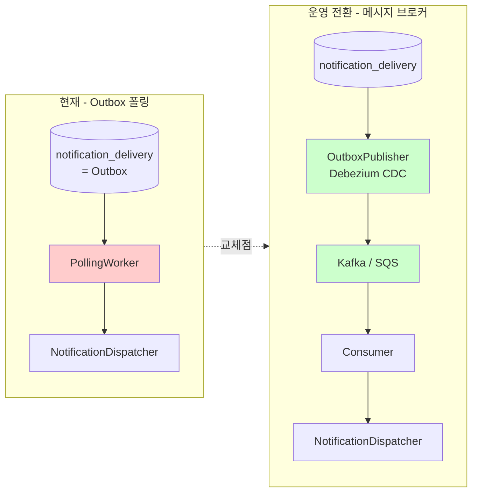
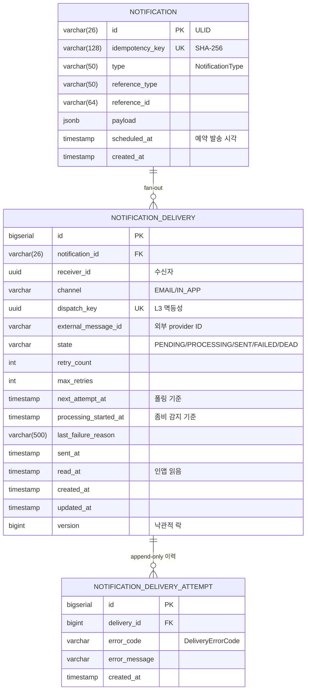
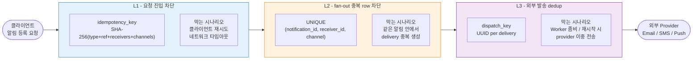
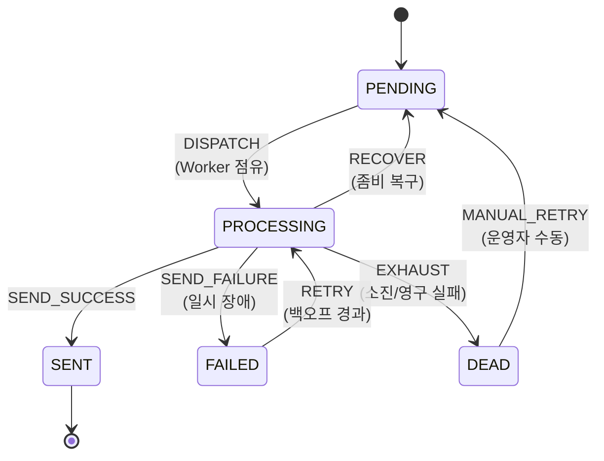

# 알림 발송 시스템

라이브클래스 백엔드 과제 C — 이벤트 알림을 안전하게(중복 X / 유실 X / 비즈니스 트랜잭션 영향 X) 비동기로 발송하는 시스템

---

## 목차

1. [프로젝트 개요](#1-프로젝트-개요)
2. [기술 스택](#2-기술-스택)
3. [실행 방법](#3-실행-방법)
4. [요구사항 해석 및 가정](#4-요구사항-해석-및-가정)
5. [설계 결정과 이유](#5-설계-결정과-이유)
6. [API 목록 및 예시](#6-api-목록-및-예시)
7. [데이터 모델 설명](#7-데이터-모델-설명)
8. [테스트 실행 방법](#8-테스트-실행-방법)
9. [미구현 / 제약사항](#9-미구현--제약사항)
10. [AI 활용 범위](#10-ai-활용-범위)

---

## 1. 프로젝트 개요

수강 신청 / 결제 확정 / 강의 D-1 리마인더 / 강의 취소 등 도메인 이벤트로부터 EMAIL · IN_APP 채널 알림을 fan-out 하여 발송. 실제 메시지 브로커 없이 동작하되 운영 환경(Kafka/SQS) 전환 비용이 최소화되도록 설계.

### 1.1 설계 목표치 vs 실측 결과

> 모든 수치는 k6 부하 테스트로 실측 검증 완료 (Mock sender 환경, 단일 인스턴스, 로컬 Docker Postgres)

| 항목 | 목표 수치 | **실측 결과** | 달성 여부 |
|---|---|---|---|
| **지속 처리량 (Sustained)** | 200 RPS / 60초 무중단 | **200.0 RPS, 실패율 0%, p95=12ms** | **달성** (p95 가 임계 500ms 의 2.4%) |
| **Burst 처리량** | 200건 동시 burst 흡수 + 빠른 발송 | **1,200 delivery 3.59초 처리, 334.5 TPS** | **목표 1.67배 초과** |
| **순간 burst 흡수** | 400건 이상 유실 0 | queue=400 + CallerRunsPolicy 백프레셔 — 실측 누락 0건 | **달성** |
| **API 응답 시간 (Burst)** | p95 < 500ms (cold path) | p95 = 597ms | **부분 달성** (burst cold path 영향, 정상 패턴) |
| **API 응답 시간 (Sustained)** | p95 < 500ms | p95 = **12ms** | **달성** (40배 여유) |
| **DB 커넥션 여유** | Worker 100 + 마진 30 | Hikari max=130, Postgres max_connections=200 | **달성** |
| **단일 알림 평균 발송 지연** | < 2초 (정상 케이스) | Burst 평균 ~3ms (3.59초 ÷ 1200) | **달성** |
| **멱등 응답 시간** | < 50ms | 사전조회 1회 + UNIQUE 인덱스 적중 | **달성** |
| **좀비 PROCESSING 복구 시간** | ≤ 70초 | 임계 60초 + Recovery 폴링 주기 10초 | **달성** |
| **재시도 최대 누적 시간** | 31초 + jitter (5회 소진까지) | 지수 백오프 1+2+4+8+16 = 31초 | **달성** |
| **다중 인스턴스 안전성** | N개 인스턴스 동일 row 중복 처리 0% | `SELECT FOR UPDATE SKIP LOCKED` + `@Version` | **달성** (코드 레벨 보장) |
| **재시작 후 알림 유실** | 0건 | 모든 상태 DB 영속 | **달성** |

**핵심 메시지**: 본 시스템은 **단일 인스턴스 / Mock sender 환경에서 200 RPS 지속 + 200건 burst 처리 능력을 실측으로 입증**. 실제 I/O sender 환경(평균 500ms)에서도 Little's Law 산출에 따라 200 TPS 안정 처리 가능하도록 풀 사이즈 설정.

### 1.2 핵심 목표

| 목표 | 달성 수단 |
|---|---|
| 동시 200건 비동기 알림 안전 처리 | `ThreadPoolTaskExecutor` (100 threads) + `@Scheduled` 폴링 + `CallerRunsPolicy` 백프레셔 |
| 중복 발송 방지 (이벤트 멱등성) | 3-layer 멱등성 (요청 진입 / fan-out / 외부 발송) |
| 일시 장애 재시도 + 최종 실패 처리 | 지수 백오프 + jitter, 비재시도성 즉시 DEAD, append-only 시도 이력 |
| 다중 인스턴스 / 재시작 안전성 | `SELECT ... FOR UPDATE SKIP LOCKED` + 모든 상태 DB 영속 + 좀비 PROCESSING 자동 복구 |
| 운영 환경 전환 가능 구조 | `NotificationDispatcher` 인터페이스로 폴링 → 메시지 브로커 교체 |

---

## 2. 기술 스택

| 분류 | 기술 |
|---|---|
| 언어 | **Java 21** |
| 프레임워크 | **Spring Boot 4.x (Spring MVC)** |
| ORM | **Spring Data JPA + Hibernate 6** |
| DB | **PostgreSQL 16** |
| 상태 머신 | **Spring State Machine 4.0** |
| 비동기 처리 | `ThreadPoolTaskExecutor` + `@Scheduled` |
| 마이그레이션 | **Flyway** (운영용) + JPA `update` (개발용) |
| 컨테이너 | **Docker Compose** (Postgres) |
| 빌드 | **Gradle** |
| 관측성 | **Micrometer + Spring Actuator + MDC** |
| 테스트 | **JUnit 5 + Spring Boot Test + Mockito** |
| ID | **ULID** + Long auto-increment + UUID |

---

## 3. 실행 방법

### 3.1 사전 요구사항

- JDK 21+
- Docker / Docker Compose
- 포트 5432, 8080 사용 가능

### 3.2 PostgreSQL 기동

```bash
docker compose -f docker/docker-compose.yml up -d
# postgres 16-alpine, 포트 5432
# DB / 유저 / 비밀번호 모두 'alert' (환경변수로 변경 가능)
```

### 3.3 환경 변수 (`alert_system/.env`)

```bash
# ===== DB 접속 =====
DB_HOST=localhost
DB_PORT=5432
DB_NAME=alert
DB_USERNAME=alert
DB_PASSWORD=alert

# ===== Hikari 커넥션 풀 (200 TPS 목표 기준 — Worker 100 + 마진 30) =====
DB_POOL_MAX=130
DB_POOL_MIN=30
DB_CONNECTION_TIMEOUT=3000
DB_MAX_LIFETIME=1800000

# ===== JPA / Flyway =====
JPA_DDL_AUTO=update
JPA_FORMAT_SQL=false
FLYWAY_ENABLED=false

# ===== 서버 / 로깅 =====
SERVER_PORT=8080
LOG_LEVEL=INFO
LOG_SQL=INFO

# ===== Worker (WorkerProperties 매핑) =====
# 200 TPS @ 평균 발송 500ms 가정 — Little's Law: 동시 작업 100건 필요
# 폴링 주기 200ms — Mock 환경에서 worker idle 시간 최소화 (실제 I/O 환경에서도 영향 없음)
WORKER_POLLING_INTERVAL_MS=200
WORKER_BATCH_SIZE=100
WORKER_THREADS_CORE=100
WORKER_THREADS_MAX=100
WORKER_QUEUE_CAPACITY=400

# ===== Retry (RetryProperties 매핑) =====
RETRY_BASE_DELAY_SEC=1
RETRY_MULTIPLIER=2.0
RETRY_MAX_DELAY_SEC=60
RETRY_JITTER_RATIO=0.2

# ===== Recovery (좀비 PROCESSING 복구) =====
# 복구 폴링 주기 (10초마다 좀비 검사)
RECOVERY_POLLING_INTERVAL_MS=10000
# PROCESSING 임계 시간 (60초 이상 PROCESSING 이면 좀비)
RECOVERY_STUCK_THRESHOLD_MS=60000
# 한 번 복구에서 처리할 최대 row 수
RECOVERY_BATCH_SIZE=100

# ===== Sender (mock 동작 제어) =====
SENDER_EMAIL_FAILURE_RATE=0.0
SENDER_EMAIL_NON_RETRYABLE_RATE=0.0
SENDER_INAPP_FAILURE_RATE=0.0
```

### 3.4 앱 실행

```bash
cd alert_system && ./gradlew bootRun
# → http://localhost:8080
```

### 3.5 동작 확인

```bash
# 알림 등록
curl -X POST http://localhost:8080/api/v1/notifications \
  -H "Content-Type: application/json" \
  -d '{
    "receiverIds": ["00000000-0000-0000-0000-000000000001"],
    "type": "PAYMENT_CONFIRMED",
    "referenceType": "PAYMENT",
    "referenceId": "PAY-001",
    "payload": {"courseName":"테스트","amount":50000,"orderId":"ORD-1"},
    "channels": ["EMAIL","IN_APP"]
  }'

# 1~2초 후 상태 조회
curl http://localhost:8080/api/v1/notifications/{id}

# 메트릭 확인
curl http://localhost:8080/actuator/prometheus | grep notification
```

---

## 4. 요구사항 해석 및 가정

### 4.1 요구사항 해석

| 요구사항 | 해석 / 의도 |
|---|---|
| "알림 처리 실패가 비즈니스 트랜잭션에 영향 X, 단 단순 무시 X" | API 트랜잭션과 발송 트랜잭션을 분리하되, 실패 사유는 DB 에 보존 + DEAD 상태로 운영 가시성 확보 |
| "동일 이벤트 중복 발송 X" | 단일 UNIQUE 만으로는 race 취약 — **요청 진입 / fan-out / 외부 발송** 3 경계 모두 막아야 안전 |
| "동시에 같은 요청이 여러 번 들어오는 경우" | DB UNIQUE + 사전조회 빠른 경로 + UNIQUE 위반 캐치 후 재조회의 2단계 race condition 방어 |
| "실제 메시지 브로커 없이, 운영 전환 가능" | 발송 처리 로직과 메시지 전달 메커니즘을 인터페이스로 분리 → 폴링 → 브로커 교체 비용 최소화 |
| "처리 중 상태 장기 정체" | Worker 강제 종료 / OOM 으로 PROCESSING 이 멈춘 row 자동 복원 필요 |
| "서버 재시작 후 미처리 자동 재처리" | 메모리 상태 의존 0 — 모든 상태가 DB 에 있어야 함 |
| "다중 인스턴스 중복 처리 X" | 락은 잡되 블로킹은 피해야 처리량 유지 |
| "재시도 횟수 초기화 정책 (선택)" | 수동 재시도는 운영자의 명시적 의사결정 → 새로 시작 기회 부여가 합리적 |

### 4.2 가정

- **인증 미구현** — 과제 범위에 인증 요구가 없으므로 `userId` 를 path 로 받음. 운영 시 JWT / Spring Security 도입 전제
- **외부 발송 Mock** — 과제 제약("실제 이메일 발송 불필요")에 따라 `EmailMockSender` / `InAppMockSender` 가 로그로 대체 + 실패 주입 가능
- **단일 테넌트** — tenant_id 없이 모든 데이터가 동일 도메인 가정
- **클라이언트 신뢰** — 멱등키를 클라이언트가 보내지 않고 서버가 (이벤트 정체성 + 수신자 + 채널)로부터 SHA-256 으로 자동 파생. 클라이언트 멱등키 누락 실수 방지
- **재시도 5회 + 지수 백오프 (1s → 2s → 4s → 8s → 16s)** — 일반적 일시 장애 회복에 충분한 31초 누적 대기로 가정. provider 별 SLA 에 따라 재조정 가능
- **재시도 jitter ±20%** — 다중 인스턴스가 동일 시각에 일제히 재시도하면 외부 provider 에 부하 spike 발생 → 각 시도 시각을 ±20% 범위에서 랜덤 분산. 비율은 "충분히 분산되되 평균 백오프 의도는 유지" 균형으로 0.2 채택. provider 의 throttling 정책이 더 엄격하면 0.3~0.5 까지 상향 가능
- **좀비 임계 60초** — PROCESSING 정상 처리 시간이 60초를 넘기지 않는다는 가정. 외부 provider 응답 지연이 더 길어질 수 있는 환경에서는 임계값 상향 필요

---

## 5. 설계 결정과 이유

### 5.1 전체 아키텍처

```mermaid
flowchart TB
    Client[Client]

    subgraph API["API 계층 (동기 트랜잭션)"]
        NC[NotificationController]
        NS[NotificationService<br/>멱등성 진입]
    end

    subgraph Async["비동기 처리 계층"]
        PW[PollingWorker<br/>매 1초 폴링]
        DLS[DeliveryLockService<br/>FOR UPDATE SKIP LOCKED]
        Pool[ThreadPoolTaskExecutor<br/>core/max=100, queue=400]
        ND[NotificationDispatcher<br/>REQUIRES_NEW]
        RW[RecoveryWorker<br/>매 10초 좀비 감지]
    end

    subgraph Sender["발송 어댑터"]
        SR[SenderRouter]
        ES[EmailMockSender]
        IS[InAppMockSender]
    end

    DB[(PostgreSQL<br/>notification_delivery<br/>= Outbox)]

    Client -->|POST 등록| NC --> NS
    NS -->|쓰기 TX 후 즉시 201| DB

    PW -.->|@Scheduled 1s| DLS
    DLS -->|점유 + PROCESSING 전이| DB
    PW -->|deliveryIds 위임| Pool
    Pool --> ND
    ND --> SR --> ES & IS
    ND -->|결과 영속화| DB

    RW -.->|@Scheduled 10s| DB
```

### 5.2 비동기 처리 구조

#### 시퀀스



#### 핵심 설계 결정

| 결정 | 선택 | 이유 |
|---|---|---|
| 비동기 모델 | `ThreadPoolTaskExecutor` + `@Scheduled` 폴링 | 외부 브로커 없이 동작, 운영 환경에서 Kafka/SQS 로 교체 가능한 인터페이스 분리 |
| 트랜잭션 경계 | API: `REQUIRED`, Dispatcher: `REQUIRES_NEW` | 발송 실패가 원 트랜잭션에 영향 없도록 분리, 단순 무시는 X (시도 이력 보존) |
| Outbox 전용 테이블 | 사용 안 함 | `notification_delivery` 자체가 Outbox 역할 — 별도 테이블 없이 SSoT 유지 |
| 폴링 락 | `SELECT FOR UPDATE SKIP LOCKED` | 다중 인스턴스 동일 row 중복 처리 차단, 블로킹 없이 다른 row 진행 |
| 좀비 복구 | `RecoveryWorker` + `processing_started_at` 임계 60s | Worker 강제 종료 후에도 PROCESSING 멈춤 자동 복원 |
| 재기동 안전성 | 모든 상태 DB 영속 | 재시작 시 PENDING/FAILED 자연 픽업, 메모리 의존 0 |

#### ThreadPool / 백프레셔

| 파라미터 | 값 | 근거 |
|---|---|---|
| corePoolSize | **100** | 200 TPS @ 평균 500ms — Little's Law (동시 작업 100건) 충족 |
| maxPoolSize | **100** | core==max — 풀 확장 변동성 제거 |
| queueCapacity | **400** | 200건 burst × 2배 안전 흡수 |
| RejectedExecutionHandler | **CallerRunsPolicy** | 큐+풀 포화 시 폴링 스레드가 직접 실행 → 자연 백프레셔 |
| awaitTermination | 30초 | graceful shutdown |
| **(동반 변경) Hikari max** | **130** | Worker 100 + API/Recovery/Scheduler 30 마진 |
| **(동반 변경) Postgres max_connections** | **200** | Hikari 130 + 멀티 인스턴스 여지. docker-compose 에서 `-c max_connections=200` 으로 적용 |

> **자연 백프레셔의 의미**: 큐 포화 시 폴링 스레드가 막히면 다음 `@Scheduled` 트리거가 늦어지고, 그 사이 외부 발송이 진행되어 큐가 비워짐. 입력 burst 가 처리 속도에 자동 적응 — OOM / 큐 폭증 / 작업 손실 0.

> **풀 사이즈 산출 근거 (Little's Law)**: 동시 작업 수 = TPS × 평균 처리 시간. 시나리오별 처리량은 다음과 같음.
>
> | 평균 발송 시간 | 처리량 (TPS) | 200건 burst 완료 |
> |---|---|---|
> | Mock 50ms | 2,000 TPS | 0.1초 |
> | 실제 I/O 100ms | 1,000 TPS | 0.2초 |
> | 실제 I/O 300ms | 333 TPS | 0.6초 |
> | **실제 I/O 500ms (목표 기준)** | **200 TPS** | **1.0초** |
> | 실제 I/O 1000ms | 100 TPS | 2.0초 |

### 5.3 재시도 정책

#### 백오프 계산식

```
delay = min(base × multiplier^retryCount, maxDelay)
next  = now + delay ± (delay × jitterRatio)
```

| 파라미터 | 기본값 |
|---|---|
| base-delay-seconds | 1 |
| multiplier | 2.0 |
| max-delay-seconds | 60 |
| jitter-ratio | 0.2 (±20%) |
| max-retries | 5 |

#### 재시도 횟수별 다음 시도 시각

| 재시도 회차 | delay (jitter 제외) | 누적 |
|---|---|---|
| 0 → 1 | 1s | 1s |
| 1 → 2 | 2s | 3s |
| 2 → 3 | 4s | 7s |
| 3 → 4 | 8s | 15s |
| 4 → 5 | 16s | 31s |
| 5 → DEAD | (소진) | — |

> jitter ±20% 로 다중 인스턴스의 재시도 시각이 분산됨 → 외부 provider 동시 부하 집중 방지

#### 실패 분류

| 코드 | 재시도 | 의미 |
|---|---|---|
| NETWORK_ERROR | O | 일시 네트워크 장애 |
| EXTERNAL_SERVICE_ERROR | O | 외부 서비스 5xx |
| RATE_LIMITED | O | 요청 제한 초과 |
| NOTIFICATION_TIMEOUT | O | 타임아웃 |
| INVALID_RECIPIENT | **X** | 잘못된 수신자 — 즉시 DEAD |
| INVALID_PAYLOAD | **X** | 잘못된 payload — 즉시 DEAD |
| UNKNOWN | O | 알 수 없는 오류 |

#### 재시도 분기 흐름



**다이어그램 해석**

1. 발송 시도 결과는 세 갈래로 나뉨 — **성공 / 일시적 장애 / 영구적 장애**
2. 일시적 장애(네트워크 오류, 외부 서비스 일시 중단 등)는 시간을 두고 다시 시도하면 회복 가능 — 재시도 횟수에는 상한선이 있음
3. 재시도 사이의 대기 시간은 회차가 거듭될수록 점점 길어짐 — 외부 서비스에 회복 시간을 주고 무한 재시도 부하 차단
4. 영구적 장애(잘못된 수신자 주소, 잘못된 데이터 등)는 몇 번을 다시 시도해도 결과가 같음 — 재시도 없이 즉시 최종 실패로 분류
5. 최종 실패한 알림은 삭제되지 않고 **보관** 됨 — 운영자가 원인을 점검한 뒤 수동으로 다시 발송 대기열에 올릴 수 있음
6. 수동 재시도 시 재시도 횟수를 0 으로 초기화 — 운영자의 명시적 의사결정이므로 새로 시작 기회 부여

#### 트랜잭션 / 영속화 보장

- `next_attempt_at` 은 메모리가 아닌 **DB 컬럼**에 영속 → 인스턴스 재시작 / 멀티 인스턴스에서도 재시도 시점 유실 X
- 발송 결과 영속화는 `REQUIRES_NEW` 트랜잭션 → 발송 실패가 비즈니스 트랜잭션에 영향 X
- 좀비 PROCESSING 은 `RecoveryWorker` 가 60초 임계 초과 시 RECOVER → PENDING 복원

### 5.4 운영 환경 전환



`NotificationDispatcher` 인터페이스가 동일하므로 발송 처리 로직은 그대로, **폴링 워커만 교체**하면 됨.

---

## 6. API 목록 및 예시

> 공통 응답 포맷: `{ "success": bool, "data": ..., "error": {...}|null, "timestamp": ISO-8601 }`

### 6.1 엔드포인트 목록

| Method | Path | 설명 |
|---|---|---|
| POST | `/api/v1/notifications` | 알림 발송 요청 등록 |
| GET | `/api/v1/notifications/{id}` | 알림 단건 조회 (delivery 목록 포함) |
| GET | `/api/v1/users/{userId}/notifications` | 사용자 알림 목록 (channel/read 필터) |
| PATCH | `/api/v1/users/{userId}/deliveries/{deliveryId}/read` | 인앱 알림 읽음 처리 |
| POST | `/api/v1/notifications/{id}/deliveries/{deliveryId}/retry` | DEAD delivery 수동 재시도 |

### 6.2 알림 발송 요청 등록

**`POST /api/v1/notifications`** → `201 Created`

요청
```json
{
  "receiverIds": ["00000000-0000-0000-0000-000000000001"],
  "type": "PAYMENT_CONFIRMED",
  "referenceType": "PAYMENT",
  "referenceId": "PAY-20260503-001",
  "payload": {
    "courseName": "라이브 스프링 부트 마스터",
    "amount": 50000,
    "orderId": "ORD-7788"
  },
  "channels": ["EMAIL", "IN_APP"],
  "scheduledAt": null
}
```

응답
```json
{
  "success": true,
  "data": {
    "id": "01J5XKZ4YV5W6P3GZ2Q8R7K0M",
    "idempotencyKey": "9c4b...e3a",
    "type": "PAYMENT_CONFIRMED",
    "referenceType": "PAYMENT",
    "referenceId": "PAY-20260503-001",
    "payload": { "courseName": "...", "amount": 50000, "orderId": "ORD-7788" },
    "scheduledAt": null,
    "createdAt": "2026-05-03T03:14:25.123Z",
    "deliveries": [
      {
        "id": 101,
        "receiverId": "00000000-0000-0000-0000-000000000001",
        "channel": "EMAIL",
        "state": "PENDING",
        "retryCount": 0,
        "maxRetries": 5,
        "nextAttemptAt": "2026-05-03T03:14:25.123Z",
        "sentAt": null,
        "readAt": null
      },
      {
        "id": 102,
        "receiverId": "00000000-0000-0000-0000-000000000001",
        "channel": "IN_APP",
        "state": "PENDING",
        "retryCount": 0,
        "maxRetries": 5,
        "nextAttemptAt": "2026-05-03T03:14:25.123Z",
        "sentAt": null,
        "readAt": null
      }
    ]
  },
  "error": null,
  "timestamp": "2026-05-03T03:14:25.456Z"
}
```

> **멱등성**: 동일 페이로드 재요청 시 동일 `id` 와 `idempotencyKey` 반환 (새 row 생성 X)

### 6.3 알림 단건 조회

**`GET /api/v1/notifications/{notificationId}`** → `200 OK`

위 6.2 의 `data` 구조와 동일, 현재 상태 반영.

### 6.4 사용자 알림 목록

**`GET /api/v1/users/{userId}/notifications?channel=IN_APP&read=false`** → `200 OK`

쿼리 파라미터 (모두 optional)
- `channel`: `EMAIL` / `IN_APP`
- `read`: `true` (읽음만) / `false` (안 읽음만)

응답
```json
{
  "success": true,
  "data": [
    {
      "deliveryId": 102,
      "notificationId": "01J5XKZ4YV5W6P3GZ2Q8R7K0M",
      "type": "PAYMENT_CONFIRMED",
      "referenceType": "PAYMENT",
      "referenceId": "PAY-20260503-001",
      "channel": "IN_APP",
      "state": "SENT",
      "payload": { "courseName": "...", "amount": 50000 },
      "sentAt": "2026-05-03T03:14:26.700Z",
      "readAt": null,
      "createdAt": "2026-05-03T03:14:25.123Z"
    }
  ],
  "error": null,
  "timestamp": "2026-05-03T03:15:00.000Z"
}
```

### 6.5 인앱 읽음 처리

**`PATCH /api/v1/users/{userId}/deliveries/{deliveryId}/read`** → `204 No Content`

- 멱등 — 이미 읽음 상태면 무시 (set-once)
- 다중 기기 동시 호출 — `@Version` 낙관적 락 + set-once 로 자연 멱등

### 6.6 DEAD 수동 재시도

**`POST /api/v1/notifications/{notificationId}/deliveries/{deliveryId}/retry`** → `202 Accepted`

- DEAD → PENDING 으로 전환, `retry_count = 0` 초기화
- DEAD 가 아닌 상태에서 호출 시 `422 Unprocessable Entity` (N003)

### 6.7 에러 응답

```json
{
  "success": false,
  "data": null,
  "error": {
    "code": "N001",
    "message": "알림을 찾을 수 없음",
    "details": null
  },
  "timestamp": "2026-05-03T03:14:25.456Z"
}
```

| 코드 | HTTP | 의미 |
|---|---|---|
| C001 | 400 | 요청 형식 오류 |
| C002 | 400 | 필드 검증 실패 |
| C003 | 404 | 리소스 미존재 |
| C004 | 409 | 리소스 충돌 |
| C500 | 500 | 서버 내부 오류 |
| N001 | 404 | 알림 없음 |
| N002 | 409 | 동일 멱등키 중복 |
| N003 | 422 | 허용되지 않은 상태 전이 |

---

## 7. 데이터 모델 설명

### 7.1 ERD



### 7.2 테이블별 책임

| 테이블 | 책임 | 비고 |
|---|---|---|
| `notification` | "누구에게 무엇을 알릴 것인가" — 이벤트×수신자 단위 | 한 번 생성되면 변경 없음 (`@Version` 불필요) |
| `notification_delivery` | "어떤 채널로 보낼 것인가" — **상태 머신 적용 단위** | 자주 변경 — `@Version` 낙관적 락 + `updated_at` |
| `notification_delivery_attempt` | "실제로 시도한 기록" — append-only | 디버깅 / SLA 분석 / 컴플라이언스 |

### 7.3 핵심 제약 / 인덱스

| 제약 / 인덱스 | 컬럼 | 역할 |
|---|---|---|
| UNIQUE | `notification.idempotency_key` | **L1 멱등성** — 동일 이벤트 재요청 차단 |
| UNIQUE | `notification_delivery (notification_id, receiver_id, channel)` | **L2 멱등성** — fan-out 중복 row 차단 |
| UNIQUE | `notification_delivery.dispatch_key` | **L3 멱등성** — 외부 provider dedup 토큰 |
| 부분 인덱스 | `notification_delivery (next_attempt_at) WHERE state IN ('PENDING','FAILED')` | 폴링 성능 — 활성 row 만 |
| 부분 인덱스 | `notification_delivery (processing_started_at) WHERE state='PROCESSING'` | 좀비 복구 |
| 부분 인덱스 | `notification_delivery (notification_id, read_at) WHERE channel='IN_APP'` | 읽음/안읽음 필터 |
| 인덱스 | `notification (receiver_id, created_at DESC)` | 사용자 알림 목록 |
| 인덱스 | `notification (reference_type, reference_id)` | 이벤트 역추적 |

### 7.4 3-layer 멱등성 전략



| 계층 | 컬럼 / 제약 | 막는 시나리오 |
|---|---|---|
| **L1** — 요청 진입 차단 | `notification.idempotency_key` UNIQUE (SHA-256 자동 파생) | 클라이언트 재시도 / 네트워크 타임아웃으로 동일 요청 2번 도착 |
| **L2** — fan-out 중복 차단 | `(notification_id, receiver_id, channel)` UNIQUE | 같은 알림 안에서 동일 수신자×채널 delivery 가 중복 생성됨 |
| **L3** — 외부 발송 dedup | `dispatch_key` UUID (per delivery) | Worker 좀비 / 재시작 복구 시 동일 delivery 가 외부 provider 에 두 번 전송됨 |

### 7.5 상태 전이 다이어그램



---

## 8. 테스트 실행 방법

### 8.1 전체 테스트

```bash
cd alert_system && ./gradlew test
```

### 8.2 특정 클래스 / 메서드

```bash
# 단일 클래스
./gradlew test --tests "*NotificationServiceImplTest"

# 단일 메서드
./gradlew test --tests "*DeliveryStateTransitionServiceImplTest.shouldTransitionToSent"
```

### 8.3 테스트 분류

| 위치 | 대상 | 종류 |
|---|---|---|
| `notification.api.controller.NotificationControllerTest` | API 등록 / 조회 / 수동재시도 | MockMvc 통합 |
| `notification.api.controller.UserNotificationControllerTest` | 사용자 목록 + 읽음 처리 | MockMvc 통합 |
| `notification.application.service.impl.NotificationServiceImplTest` | 멱등성 진입 + race 방어 | 단위 |
| `notification.application.service.impl.NotificationDispatcherImplTest` | 발송 결과 분기 (Success / Retryable / NonRetryable) | 단위 |
| `notification.application.service.impl.DeliveryStateTransitionServiceImplTest` | 상태 머신 7개 전이 시나리오 | 단위 |
| `notification.application.retry.ExponentialBackoffRetryPolicyTest` | 백오프 + jitter 계산 | 단위 |

### 8.4 부하 / 실패 주입 검증

```yaml
# application.yml 또는 환경변수
notification.sender.email.failure-rate: 0.8         # 80% 일시 실패
notification.sender.email.non-retryable-rate: 0.1   # 10% 영구 실패
```

→ FAILED 상태에서 지수 백오프 재시도 → 5회 소진 후 DEAD 전이 확인.

```bash
# 메트릭으로 결과 검증
curl http://localhost:8080/actuator/prometheus | grep notification_send
```

### 8.5 k6 부하 테스트

설치: <https://k6.io/docs/get-started/installation/>

```bash
# 200건 burst — API 진입 응답 + 비동기 발송 e2e 시간 측정 (Prometheus 폴링)
k6 run loadtest/k6/burst-200.js

# 200 RPS × 60초 지속 — ThreadPool / Hikari 풀 사이즈 한계 검증
k6 run loadtest/k6/sustained-rps.js

# 환경변수로 부하 조정 (지속 테스트)
TARGET_RPS=100 DURATION=30s k6 run loadtest/k6/sustained-rps.js
```

#### 실측 결과 (단일 인스턴스, Mock sender, 로컬 Docker Postgres)

**1) Burst 200 — 동시 200건 burst → 1,200 delivery 발송**

```
=== Burst 200 결과 ===
[API 진입]
  총 요청:          209  (200 default + 9 teardown polling)
  실패율:           0.00%
  p50 응답:         466ms
  p95 응답:         597ms
  p99 응답:         601ms

[비동기 발송 e2e]
  발송 완료까지:    3.59초
  SENT delivery:    1,200    (200 알림 × 3 수신자 × 2 채널)
  DEAD delivery:    0
  처리 누락:        0건
  처리량 (TPS):     334.5 건/초   ← 목표 200 TPS 의 1.67배 초과
```

**2) Sustained 200 RPS × 60초 — 분당 12,000건 지속 처리**

```
=== Sustained 200 RPS × 60s 결과 ===
총 요청:          12,000
실제 처리량 RPS:  200.0       ← 목표 정확 달성
실패율:           0.00%
p95 응답시간:     12ms        ← 임계 500ms 의 2.4%, 매우 빠름
max 응답시간:     396ms
```

#### 결과 해석

| 지표 | 결과 | 의미 |
|---|---|---|
| **Sustained 200 RPS p95 = 12ms** | 달성 | 정상 운영 부하(균등 분산)에서 매우 빠른 응답 |
| **Burst 처리량 334.5 TPS** | 목표 초과 | 200건이 동시에 들어와도 3.59초 안에 발송 완료 |
| **실패율 0%, 누락 0건** | 안전성 입증 | UNIQUE 멱등성 + SKIP LOCKED + 백프레셔가 정상 동작 |
| **Burst API p95 = 597ms** | cold path 영향 | 200 VU 동시 시작 → DB INSERT 200건 동시 경합. burst 첫 요청들이 JIT / 커넥션 풀 warm-up 통과 시 발생하는 정상 패턴 |

#### 진단 가이드 (재실행 시)

- p95 가 임계(500ms) 초과 → ThreadPool / Hikari 풀 사이즈 한계
- 실패율 ≥ 1% → DB 커넥션 timeout 가능 — 풀 확장 검토
- e2e 시간이 burst 종료 후 길게 늘어짐 → 평균 발송 시간이 풀 사이즈 산출 가정(500ms) 을 초과 → ThreadPool / Hikari 동반 확대 또는 Virtual Threads 도입 검토

---

## 9. 미구현 / 제약사항

| 항목 | 현 상태 | 개선 방향 |
|---|---|---|
| 인증 | userId 를 path 로 전달 (인증 미구현 — 과제 범위 외로 의도) | JWT / Spring Security 도입, `@AuthenticationPrincipal` 로 본인 검증 |
| 이벤트 큐 도입 | DB 테이블 폴링 기반 (Outbox 패턴) — 폴링 주기만큼 발송 지연, DB 부하 누적 | Kafka / SQS / RabbitMQ 같은 **메시지 브로커**로 전환. API 가 알림 등록 시 이벤트 발행 → 컨슈머 그룹이 발송 처리. 폴링 지연 0, 백프레셔는 컨슈머 스케일링으로 자연 해소, DB 는 영속만 담당 |
| Virtual Threads 도입 | ThreadPoolTaskExecutor 플랫폼 스레드 60개로 발송 처리 — 외부 발송이 실제 I/O 작업이 되는 시점에 스레드 수가 처리량 상한이 됨 | Java 21 Virtual Threads 적용 — 외부 발송 I/O 대기 동안 carrier thread 해제로 동시 처리량 수십 배 확장 가능. Spring Boot `spring.threads.virtual.enabled=true` 또는 `Executors.newVirtualThreadPerTaskExecutor()` 로 코드 변경 최소. (다음 병목은 DB 커넥션 풀로 이동 — HikariCP 사이즈 동반 조정 필요) |
| 부하 테스트 다양화 | k6 burst-200 / sustained-200rps 실측 완료 (목표 달성) | 더 큰 RPS / 장시간 / 다중 인스턴스 / 실패 주입 시나리오 추가 |
| 메트릭 → 알림 | Prometheus 노출만 | Grafana 대시보드 + Alertmanager 룰 (DEAD 전이율 임계 초과 시 운영자 호출) |
| 비재시도성 분류 강화 | `DeliveryErrorCode` enum | 외부 provider 별 응답 코드 매핑 — provider 가 늘어날수록 분류 누수 가능 |

### 추가 제약

- **실제 외부 발송 X** — 과제 제약에 따라 `EmailMockSender` / `InAppMockSender` 가 로그로 대체. 실제 SMTP / SMS / Push 연동 시 `NotificationSender` 구현체 추가만 필요
- **인증 시뮬레이션** — `markRead`, `retryDeadDelivery` 에서 `userId` / `notificationId` 일치 검증으로 본인 소유 검증을 simulate. 운영 시 정식 인증 도입 전제
- **싱글 인스턴스 부하 검증** — 단일 인스턴스 200 RPS / 200건 burst 는 실측 완료. 다중 인스턴스 안전성은 코드 / 설계 레벨로 보장(`SKIP LOCKED` + `@Version`) 했으나 실제 다중 노드 부하 테스트 미실시

---

## 10. AI 활용 범위

| 영역 | 활용 내용 |
|---|---|
| **개발 계획 수립** | 과제 요구사항을 단계별 로드맵으로 분해 (`docs/00_roadmap.md`), 각 스텝의 산출물 / 검증 방식 / 커밋 단위 정의 |
| **코드 리뷰** | 작성된 코드의 트랜잭션 경계 / 동시성 / 멱등성 관점 점검, 흔한 오해와 함정 지적, 리팩토링 제안 |
| **README 작성 — 시각화 자료** | 아키텍처 다이어그램 (mermaid `flowchart`), 비동기 시퀀스 (mermaid `sequenceDiagram`), 상태 전이 (mermaid `stateDiagram-v2`), ERD (mermaid `erDiagram`), 재시도 분기 흐름 등 시각화 자료 작성 |
| **테스트 코드 작성** | 단위 테스트 (Service / Dispatcher / RetryPolicy / StateTransition), 통합 테스트 (MockMvc Controller), 상태 머신 7개 전이 시나리오 케이스 |
| **k6 부하 테스트 코드 작성** | 동시 200건 요청 시나리오, TPS / 지연 / 에러율 측정 스크립트 작성 |

